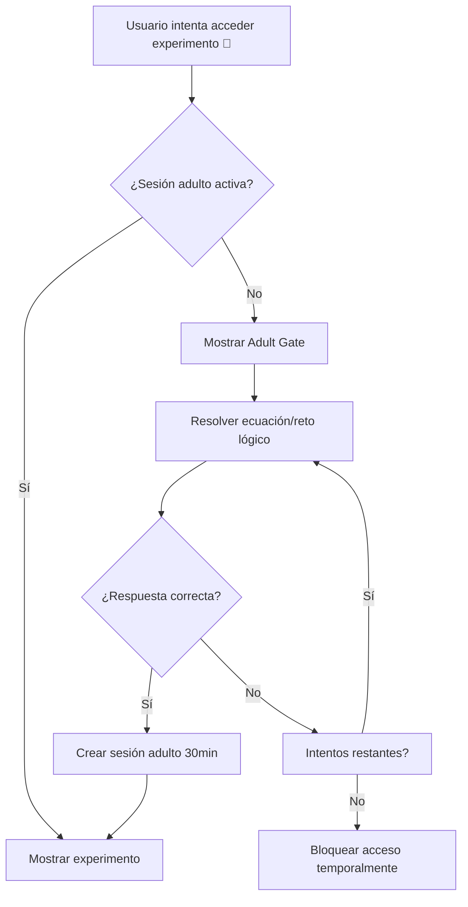
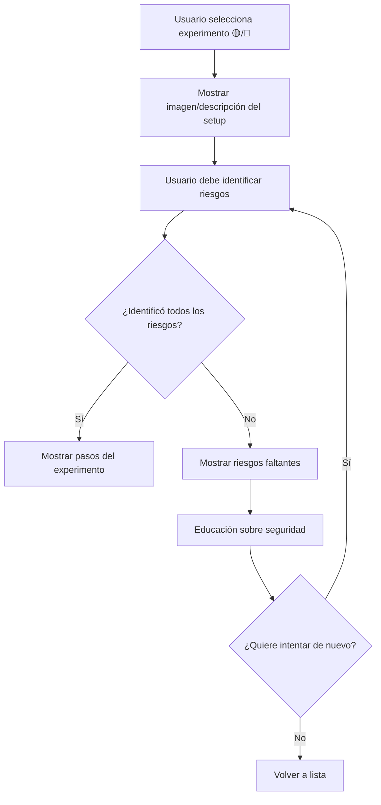
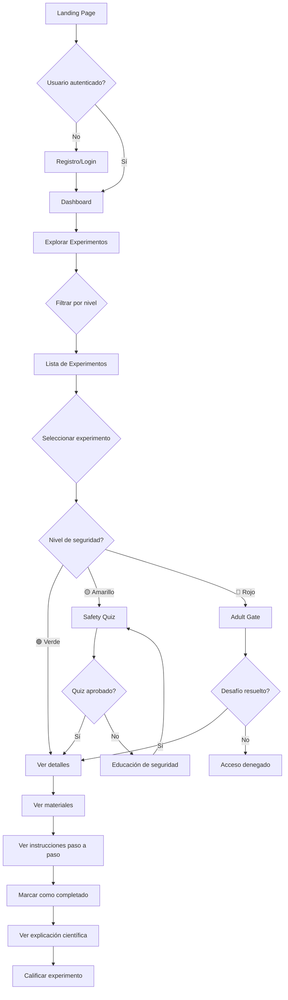

# 🏗️ STEM Home Lab - Plan de Arquitectura Técnica

## 📋 Resumen Ejecutivo

**Proyecto**: Plataforma educativa de experimentos STEM para niños con seguridad integrada  
**Stack Tecnológico**: Next.js 14+ (TypeScript) + Node.js/Express + PostgreSQL  
**Prioridad MVP**: Estructura completa + 5-10 experimentos de ejemplo  
**Filosofía**: Seguridad como restricción lógica inquebrantable del software

---

## 🎯 Stack Tecnológico Seleccionado

### Frontend
- **Framework**: Next.js 14+ (App Router)
- **Lenguaje**: TypeScript
- **Estilos**: Tailwind CSS + shadcn/ui
- **Validación**: Zod
- **Estado**: React Context + Zustand (para estado complejo)
- **Animaciones**: Framer Motion

### Backend
- **Runtime**: Node.js 20+
- **Framework**: Express.js + TypeScript
- **Validación**: Zod (compartido con frontend)
- **ORM**: Prisma (para PostgreSQL)
- **Autenticación**: NextAuth.js

### Base de Datos
- **Principal**: PostgreSQL (usuarios, logs, sesiones)
- **Experimentos**: Sistema de archivos (JSON/MD versionados en Git)
- **Cache**: Redis (opcional para producción)

### DevOps
- **Monorepo**: Turborepo o pnpm workspaces
- **Testing**: Vitest + React Testing Library
- **CI/CD**: GitHub Actions
- **Deployment**: Vercel (frontend) + Railway/Render (backend)

---

## 📁 Estructura del Repositorio

```
stem-home-lab/
├── .github/
│   ├── workflows/
│   │   ├── ci.yml
│   │   ├── validate-experiments.yml
│   │   └── deploy.yml
│   └── PULL_REQUEST_TEMPLATE.md
│
├── apps/
│   ├── web/                          # Next.js Frontend
│   │   ├── app/
│   │   │   ├── (auth)/
│   │   │   │   ├── login/
│   │   │   │   └── adult-gate/
│   │   │   ├── (main)/
│   │   │   │   ├── experiments/
│   │   │   │   │   ├── page.tsx
│   │   │   │   │   └── [id]/
│   │   │   │   │       ├── page.tsx
│   │   │   │   │       └── safety-check/
│   │   │   │   ├── materials/
│   │   │   │   └── about/
│   │   │   ├── api/
│   │   │   │   ├── experiments/
│   │   │   │   └── safety/
│   │   │   ├── layout.tsx
│   │   │   └── page.tsx
│   │   ├── components/
│   │   │   ├── ui/                   # shadcn components
│   │   │   ├── experiments/
│   │   │   │   ├── ExperimentCard.tsx
│   │   │   │   ├── SafetyBadge.tsx
│   │   │   │   ├── HazardWarning.tsx
│   │   │   │   └── MaterialsList.tsx
│   │   │   ├── safety/
│   │   │   │   ├── AdultGate.tsx
│   │   │   │   ├── SafetyQuiz.tsx
│   │   │   │   └── RiskIdentification.tsx
│   │   │   └── layout/
│   │   │       ├── Header.tsx
│   │   │       ├── Footer.tsx
│   │   │       └── SafetyModeToggle.tsx
│   │   ├── lib/
│   │   │   ├── experiments.ts
│   │   │   ├── safety.ts
│   │   │   └── utils.ts
│   │   ├── styles/
│   │   ├── public/
│   │   │   ├── images/
│   │   │   └── icons/
│   │   ├── package.json
│   │   ├── tsconfig.json
│   │   └── next.config.js
│   │
│   └── api/                          # Express Backend (opcional)
│       ├── src/
│       │   ├── controllers/
│       │   ├── middleware/
│       │   ├── routes/
│       │   ├── services/
│       │   └── index.ts
│       ├── package.json
│       └── tsconfig.json
│
├── packages/
│   ├── shared/                       # Código compartido
│   │   ├── src/
│   │   │   ├── types/
│   │   │   │   ├── experiment.ts
│   │   │   │   ├── safety.ts
│   │   │   │   └── material.ts
│   │   │   ├── schemas/
│   │   │   │   ├── experiment.schema.ts
│   │   │   │   └── safety.schema.ts
│   │   │   ├── constants/
│   │   │   │   ├── hazards.ts
│   │   │   │   ├── safety-levels.ts
│   │   │   │   └── material-sources.ts
│   │   │   └── utils/
│   │   │       ├── validation.ts
│   │   │       └── safety-checks.ts
│   │   ├── package.json
│   │   └── tsconfig.json
│   │
│   └── ui/                           # Componentes UI compartidos
│       ├── src/
│       ├── package.json
│       └── tsconfig.json
│
├── experiments/                      # Contenido de experimentos
│   ├── _templates/
│   │   ├── experiment-template.md
│   │   └── experiment-template.json
│   ├── basic/
│   │   ├── 001-volcan-bicarbonato.json
│   │   ├── 001-volcan-bicarbonato.md
│   │   ├── 002-arcoiris-densidad.json
│   │   └── 002-arcoiris-densidad.md
│   ├── intermediate/
│   │   ├── 001-electroiman-casero.json
│   │   ├── 001-electroiman-casero.md
│   │   ├── 002-motor-electrico-simple.json
│   │   └── 002-motor-electrico-simple.md
│   ├── advanced/
│   │   ├── 001-celda-solar-casera.json
│   │   └── 001-celda-solar-casera.md
│   ├── images/
│   │   ├── basic/
│   │   ├── intermediate/
│   │   └── advanced/
│   └── README.md
│
├── docs/
│   ├── ARCHITECTURE.md
│   ├── CONTRIBUTING.md
│   ├── SAFETY_GUIDELINES.md
│   ├── EXPERIMENT_CREATION.md
│   ├── API_REFERENCE.md
│   └── DEPLOYMENT.md
│
├── scripts/
│   ├── validate-experiments.ts
│   ├── generate-experiment.ts
│   └── seed-database.ts
│
├── prisma/
│   ├── schema.prisma
│   ├── migrations/
│   └── seed.ts
│
├── .gitignore
├── .eslintrc.js
├── .prettierrc
├── package.json
├── pnpm-workspace.yaml
├── turbo.json
├── tsconfig.json
└── README.md
```

---

## 🔐 Sistema de Seguridad - Arquitectura Detallada

### 1. Niveles de Seguridad (Safety Levels)

```typescript
enum SafetyLevel {
  GREEN = 'green',    // 🟢 Autónomo
  YELLOW = 'yellow',  // 🟡 Supervisión sugerida
  RED = 'red'         // 🔴 Supervisión obligatoria
}
```

### 2. Hazard Tags (Categorías de Riesgo)

```typescript
enum HazardTag {
  CHEMICAL_REACTION = 'chemical_reaction',
  ELECTRICAL_CIRCUIT = 'electrical_circuit',
  HIGH_TEMPERATURE = 'high_temperature',
  SHARP_OBJECTS = 'sharp_objects',
  FIRE_RISK = 'fire_risk',
  TOXIC_MATERIALS = 'toxic_materials',
  PRESSURE_RISK = 'pressure_risk',
  BIOLOGICAL_HAZARD = 'biological_hazard'
}
```

### 3. EPP (Equipo de Protección Personal)

```typescript
enum PPE {
  SAFETY_GOGGLES = 'safety_goggles',
  GLOVES = 'gloves',
  LAB_COAT = 'lab_coat',
  MASK = 'mask',
  CLOSED_SHOES = 'closed_shoes',
  APRON = 'apron'
}
```

### 4. Guardrails Implementados

#### A. Adult Gate (Desafío Lógico)


**Tipos de desafíos**:
- Ecuaciones matemáticas (ej: "Resuelve: 3x + 7 = 22")
- Problemas lógicos (ej: "Si A > B y B > C, ¿quién es mayor?")
- Preguntas de seguridad (ej: "¿Qué hacer si hay un incendio?")

#### B. Simulación de Seguridad Obligatoria


#### C. Modo "Científico Solo"
```typescript
interface SafetyMode {
  enabled: boolean;
  allowedLevels: SafetyLevel[];
}

// Estado global
const safetyMode: SafetyMode = {
  enabled: false,
  allowedLevels: [SafetyLevel.GREEN]
};

// Filtro dinámico
function filterExperiments(experiments: Experiment[]): Experiment[] {
  if (!safetyMode.enabled) return experiments;
  return experiments.filter(exp => 
    safetyMode.allowedLevels.includes(exp.safetyLevel)
  );
}
```

---

## 📊 Esquema de Datos para Experimentos

### Estructura JSON Completa

```json
{
  "id": "intermediate-001",
  "slug": "electroiman-casero",
  "version": "1.0.0",
  "metadata": {
    "title": "Electroimán Casero",
    "description": "Construye un electroimán funcional usando materiales cotidianos",
    "level": "intermediate",
    "safetyLevel": "yellow",
    "duration": {
      "preparation": 10,
      "execution": 20,
      "cleanup": 5,
      "unit": "minutes"
    },
    "ageRange": {
      "min": 8,
      "max": 14,
      "recommended": 10
    },
    "subjects": ["physics", "electricity", "magnetism"],
    "keywords": ["electromagnet", "magnetic field", "electric current"]
  },
  "safety": {
    "level": "yellow",
    "hazards": [
      {
        "tag": "electrical_circuit",
        "severity": "medium",
        "description": "Uso de batería y circuito eléctrico simple"
      }
    ],
    "requiredPPE": ["safety_goggles"],
    "supervisionRequired": true,
    "adultGateRequired": false,
    "warnings": [
      "No usar baterías de más de 9V",
      "Supervisar el calentamiento del cable",
      "No tocar los extremos del cable mientras está conectado"
    ],
    "emergencyProcedures": [
      "Si el cable se calienta demasiado, desconectar inmediatamente",
      "En caso de quemadura leve, aplicar agua fría"
    ]
  },
  "materials": {
    "home": [
      {
        "name": "Clavo de hierro grande",
        "quantity": 1,
        "unit": "piece",
        "alternatives": ["Tornillo largo de hierro"],
        "notes": "Debe ser de hierro, no de acero inoxidable"
      }
    ],
    "supermarket": [
      {
        "name": "Cinta aislante",
        "quantity": 1,
        "unit": "roll",
        "estimatedCost": 2.50,
        "currency": "USD"
      }
    ],
    "pharmacy": [],
    "hardware": [
      {
        "name": "Cable de cobre esmaltado",
        "quantity": 2,
        "unit": "meters",
        "estimatedCost": 3.00,
        "currency": "USD",
        "specifications": "Calibre 22-24 AWG"
      },
      {
        "name": "Batería de 9V",
        "quantity": 1,
        "unit": "piece",
        "estimatedCost": 2.00,
        "currency": "USD"
      }
    ],
    "optional": [
      {
        "name": "Clips metálicos",
        "quantity": 10,
        "unit": "pieces",
        "purpose": "Para probar el magnetismo"
      }
    ],
    "totalEstimatedCost": 7.50,
    "currency": "USD"
  },
  "instructions": {
    "preparation": [
      {
        "step": 1,
        "action": "Reunir todos los materiales en un área de trabajo limpia",
        "duration": 2,
        "safetyNote": "Asegúrate de tener espacio suficiente"
      },
      {
        "step": 2,
        "action": "Verificar que la batería esté en buen estado",
        "duration": 1,
        "safetyNote": "No usar baterías dañadas o hinchadas"
      }
    ],
    "execution": [
      {
        "step": 1,
        "action": "Enrollar el cable de cobre alrededor del clavo",
        "details": "Dar aproximadamente 50-100 vueltas, dejando 15cm libres en cada extremo",
        "duration": 10,
        "safetyNote": "Enrollar firmemente pero sin dañar el cable",
        "hazardTags": [],
        "image": "images/intermediate/electroiman-step1.jpg"
      },
      {
        "step": 2,
        "action": "Lijar los extremos del cable",
        "details": "Remover el esmalte de los últimos 2cm de cada extremo",
        "duration": 3,
        "safetyNote": "Usar lija suavemente para no romper el cable",
        "hazardTags": ["sharp_objects"]
      },
      {
        "step": 3,
        "action": "Conectar los extremos del cable a la batería",
        "details": "Un extremo al polo positivo, otro al negativo",
        "duration": 2,
        "safetyNote": "⚠️ CRÍTICO: El cable puede calentarse. No mantener conectado más de 30 segundos",
        "hazardTags": ["electrical_circuit", "high_temperature"],
        "criticalStep": true
      },
      {
        "step": 4,
        "action": "Probar el electroimán con clips metálicos",
        "details": "Acercar el clavo a los clips y observar cómo son atraídos",
        "duration": 5,
        "safetyNote": "Desconectar la batería entre pruebas"
      }
    ],
    "cleanup": [
      {
        "step": 1,
        "action": "Desconectar la batería inmediatamente",
        "duration": 1,
        "safetyNote": "No dejar conectado sin supervisión"
      },
      {
        "step": 2,
        "action": "Guardar los materiales de forma segura",
        "duration": 4
      }
    ]
  },
  "science": {
    "principle": "Electromagnetismo",
    "explanation": "Cuando la corriente eléctrica fluye a través del cable enrollado, crea un campo magnético alrededor del clavo de hierro. El hierro amplifica este campo magnético, convirtiéndose en un imán temporal. Al desconectar la corriente, el magnetismo desaparece.",
    "concepts": [
      {
        "name": "Campo magnético",
        "description": "Región del espacio donde actúan fuerzas magnéticas"
      },
      {
        "name": "Corriente eléctrica",
        "description": "Flujo de electrones a través de un conductor"
      },
      {
        "name": "Núcleo ferromagnético",
        "description": "Material que amplifica el campo magnético"
      }
    ],
    "realWorldApplications": [
      "Motores eléctricos",
      "Altavoces",
      "Grúas electromagnéticas",
      "Timbres y zumbadores",
      "Discos duros de computadora"
    ],
    "furtherReading": [
      {
        "title": "¿Cómo funcionan los electroimanes?",
        "url": "https://example.com/electroimanes",
        "type": "article"
      }
    ]
  },
  "extensions": {
    "variations": [
      "Probar con diferentes números de vueltas del cable",
      "Usar diferentes voltajes de batería (con supervisión)",
      "Comparar con diferentes materiales de núcleo"
    ],
    "challenges": [
      "¿Cuántos clips puede levantar tu electroimán?",
      "¿Qué pasa si inviertes la polaridad de la batería?",
      "¿Puedes hacer un electroimán más fuerte?"
    ],
    "relatedExperiments": [
      "intermediate-002-motor-electrico-simple",
      "basic-003-circuito-simple"
    ]
  },
  "media": {
    "thumbnail": "images/intermediate/electroiman-thumbnail.jpg",
    "gallery": [
      "images/intermediate/electroiman-materials.jpg",
      "images/intermediate/electroiman-process.jpg",
      "images/intermediate/electroiman-result.jpg"
    ],
    "video": {
      "url": "https://youtube.com/watch?v=example",
      "duration": 180,
      "language": "es"
    }
  },
  "credits": {
    "author": "IBM Bob",
    "contributors": [],
    "reviewedBy": ["Safety Team"],
    "lastReviewed": "2026-05-15",
    "version": "1.0.0"
  },
  "tracking": {
    "created": "2026-05-15T00:00:00Z",
    "updated": "2026-05-15T00:00:00Z",
    "views": 0,
    "completions": 0,
    "rating": 0,
    "difficulty_feedback": []
  }
}
```

---

## 🗄️ Esquema de Base de Datos (PostgreSQL)

```prisma
// prisma/schema.prisma

generator client {
  provider = "prisma-client-js"
}

datasource db {
  provider = "postgresql"
  url      = env("DATABASE_URL")
}

model User {
  id            String    @id @default(cuid())
  email         String    @unique
  name          String?
  role          UserRole  @default(STUDENT)
  createdAt     DateTime  @default(now())
  updatedAt     DateTime  @updatedAt
  
  sessions      Session[]
  completions   ExperimentCompletion[]
  ratings       ExperimentRating[]
  adultSessions AdultSession[]
}

enum UserRole {
  STUDENT
  PARENT
  EDUCATOR
  ADMIN
}

model Session {
  id           String   @id @default(cuid())
  userId       String
  user         User     @relation(fields: [userId], references: [id], onDelete: Cascade)
  expiresAt    DateTime
  createdAt    DateTime @default(now())
}

model AdultSession {
  id           String   @id @default(cuid())
  userId       String
  user         User     @relation(fields: [userId], references: [id], onDelete: Cascade)
  expiresAt    DateTime
  challengeType String
  createdAt    DateTime @default(now())
}

model ExperimentCompletion {
  id            String   @id @default(cuid())
  userId        String
  user          User     @relation(fields: [userId], references: [id], onDelete: Cascade)
  experimentId  String
  completedAt   DateTime @default(now())
  duration      Int?     // in minutes
  notes         String?
  
  @@unique([userId, experimentId])
}

model ExperimentRating {
  id            String   @id @default(cuid())
  userId        String
  user          User     @relation(fields: [userId], references: [id], onDelete: Cascade)
  experimentId  String
  rating        Int      // 1-5
  difficulty    Int?     // 1-5
  comment       String?
  createdAt     DateTime @default(now())
  
  @@unique([userId, experimentId])
}

model SafetyLog {
  id            String   @id @default(cuid())
  experimentId  String
  eventType     SafetyEventType
  description   String
  severity      SafetySeverity
  userId        String?
  createdAt     DateTime @default(now())
}

enum SafetyEventType {
  ACCESS_DENIED
  ADULT_GATE_PASSED
  ADULT_GATE_FAILED
  SAFETY_QUIZ_PASSED
  SAFETY_QUIZ_FAILED
  RISK_IDENTIFIED
  WARNING_SHOWN
}

enum SafetySeverity {
  INFO
  WARNING
  CRITICAL
}
```

---

## 🎨 Componentes UI Clave

### 1. ExperimentCard
```typescript
interface ExperimentCardProps {
  experiment: Experiment;
  onSelect: (id: string) => void;
  safetyMode: boolean;
}
```

### 2. SafetyBadge
```typescript
interface SafetyBadgeProps {
  level: SafetyLevel;
  size?: 'sm' | 'md' | 'lg';
  showLabel?: boolean;
}
```

### 3. AdultGate
```typescript
interface AdultGateProps {
  onSuccess: () => void;
  onCancel: () => void;
  challengeType?: 'math' | 'logic' | 'safety';
}
```

### 4. SafetyQuiz
```typescript
interface SafetyQuizProps {
  experiment: Experiment;
  onComplete: (passed: boolean) => void;
}
```

### 5. MaterialsList
```typescript
interface MaterialsListProps {
  materials: Materials;
  showCosts?: boolean;
  groupBySource?: boolean;
}
```

---

## 🔄 Flujo de Usuario Principal



---

## 📝 Lista de Experimentos Propuestos (MVP)

### Nivel Básico (🟢)
1. **Volcán de Bicarbonato** - Reacción química simple
2. **Arcoíris de Densidad** - Densidad de líquidos
3. **Globo que no Explota** - Transferencia de calor
4. **Tinta Invisible** - Reacciones químicas

### Nivel Intermedio (🟡)
1. **Electroimán Casero** - Electromagnetismo
2. **Motor Eléctrico Simple** - Conversión de energía
3. **Lámpara de Lava Casera** - Densidad y polaridad
4. **Péndulo de Newton** - Conservación de energía

### Nivel Avanzado (🔴)
1. **Celda Solar Casera** - Energía fotovoltaica
2. **Cohete de Agua** - Presión y propulsión
3. **Generador Eléctrico Simple** - Inducción electromagnética

---

## 🚀 Roadmap de Implementación

### Fase 1: Fundación (Semanas 1-2)
- [x] Definir stack tecnológico
- [ ] Crear estructura de repositorio
- [ ] Configurar monorepo (Turborepo/pnpm)
- [ ] Configurar TypeScript + ESLint + Prettier
- [ ] Crear esquemas Zod para validación
- [ ] Diseñar sistema de tipos compartidos

### Fase 2: Contenido (Semanas 3-4)
- [ ] Crear plantillas de experimentos
- [ ] Generar 5-10 experimentos de ejemplo
- [ ] Crear imágenes/diagramas para experimentos
- [ ] Escribir documentación de contribución
- [ ] Implementar script de validación

### Fase 3: Frontend Base (Semanas 5-6)
- [ ] Configurar Next.js 14 con App Router
- [ ] Implementar sistema de diseño (Tailwind + shadcn/ui)
- [ ] Crear componentes UI base
- [ ] Implementar páginas principales
- [ ] Integrar sistema de lectura de experimentos

### Fase 4: Sistema de Seguridad (Semanas 7-8)
- [ ] Implementar Adult Gate
- [ ] Crear Safety Quiz component
- [ ] Implementar Modo Científico Solo
- [ ] Crear sistema de logging de seguridad
- [ ] Testing exhaustivo de guardrails

### Fase 5: Backend & Base de Datos (Semanas 9-10)
- [ ] Configurar Prisma + PostgreSQL
- [ ] Implementar autenticación (NextAuth.js)
- [ ] Crear API endpoints
- [ ] Implementar sistema de tracking
- [ ] Configurar sistema de ratings

### Fase 6: Testing & Deployment (Semanas 11-12)
- [ ] Testing unitario (Vitest)
- [ ] Testing de integración
- [ ] Testing E2E (Playwright)
- [ ] Configurar CI/CD
- [ ] Deploy a producción

---

## 🔒 Consideraciones de Seguridad Adicionales

### 1. Validación de Contenido
- Todos los experimentos deben pasar validación de esquema
- Revisión manual obligatoria para experimentos 🔴
- Sistema de versioning para cambios en experimentos

### 2. Logging y Auditoría
- Registrar todos los intentos de acceso a experimentos 🔴
- Tracking de Adult Gate (éxitos/fallos)
- Monitoreo de patrones sospechosos

### 3. Rate Limiting
- Limitar intentos de Adult Gate (3 por hora)
- Prevenir scraping de contenido
- Protección contra bots

### 4. Privacidad
- No requerir información personal de niños
- Cumplimiento con COPPA (Children's Online Privacy Protection Act)
- Datos mínimos necesarios

---

## 📚 Documentación Requerida

1. **README.md** - Introducción al proyecto
2. **CONTRIBUTING.md** - Guía para contribuidores
3. **SAFETY_GUIDELINES.md** - Directrices de seguridad
4. **EXPERIMENT_CREATION.md** - Cómo crear experimentos
5. **API_REFERENCE.md** - Documentación de API
6. **DEPLOYMENT.md** - Guía de deployment

---

## 🎯 Métricas de Éxito

### Técnicas
- 100% de experimentos validados por esquema
- 0 experimentos 🔴 accesibles sin Adult Gate
- < 100ms tiempo de carga de experimentos
- 95%+ cobertura de tests

### Producto
- 10+ experimentos de calidad en MVP
- Sistema de seguridad robusto y probado
- Documentación completa y clara
- Experiencia de usuario fluida

### Educativas
- Explicaciones científicas claras
- Materiales accesibles y económicos
- Instrucciones paso a paso detalladas
- Aplicaciones del mundo real

---

## 🤝 Próximos Pasos

1. **Revisar y aprobar este plan arquitectónico**
2. **Crear estructura de carpetas del repositorio**
3. **Implementar esquemas de validación**
4. **Generar primer experimento completo (Electroimán)**
5. **Comenzar desarrollo del frontend base**

---

**Documento creado por**: IBM Bob  
**Fecha**: 2026-05-15  
**Versión**: 1.0.0  
**Estado**: Pendiente de aprobación